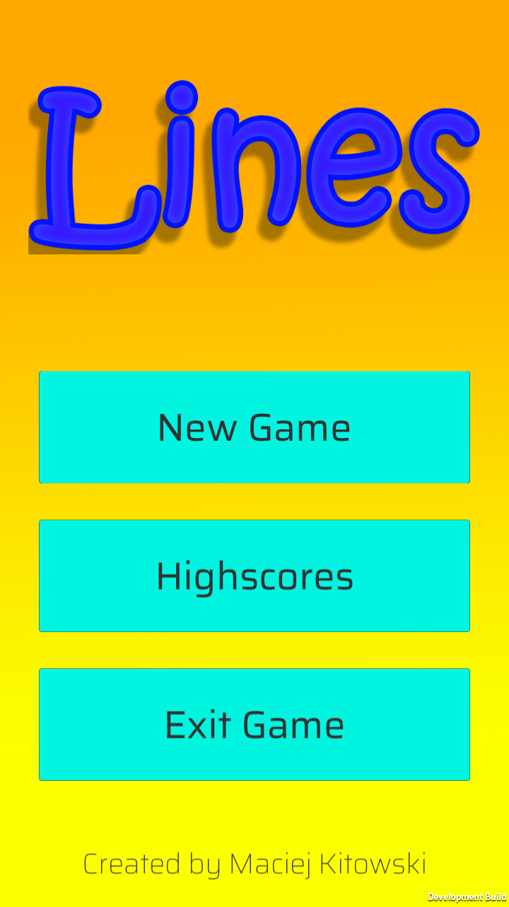
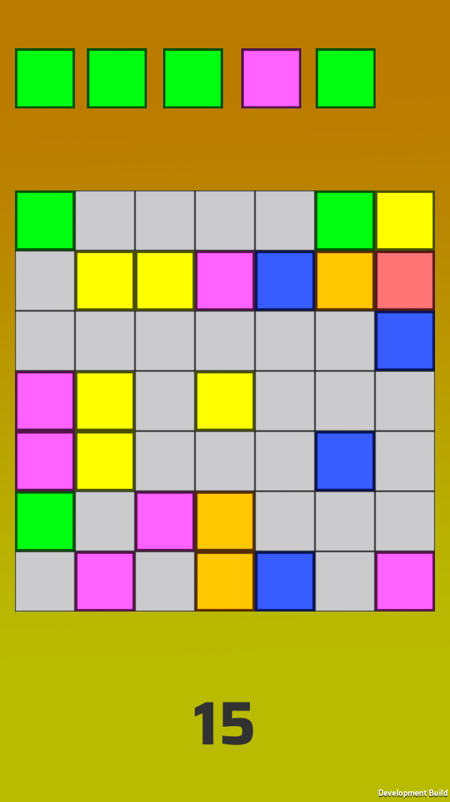
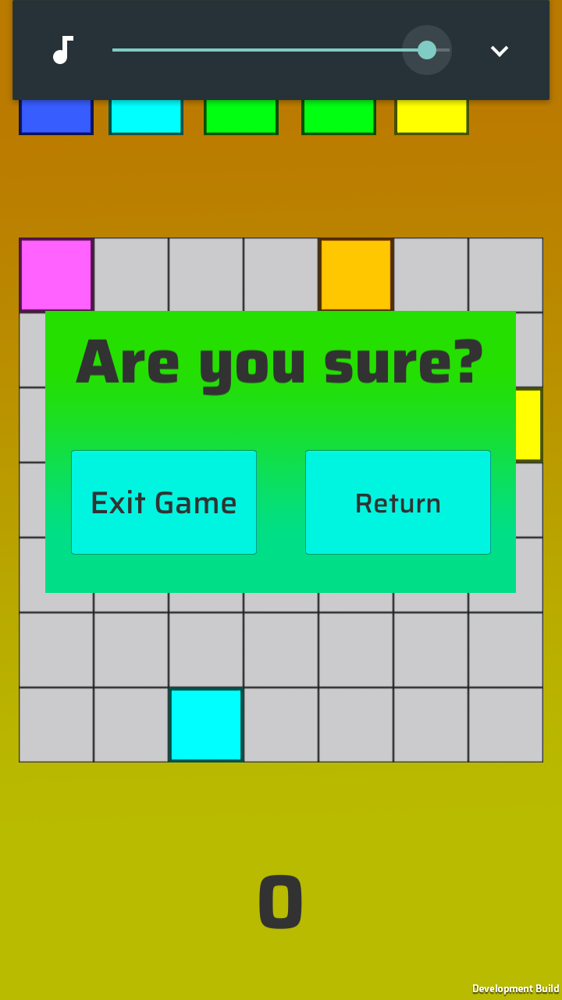
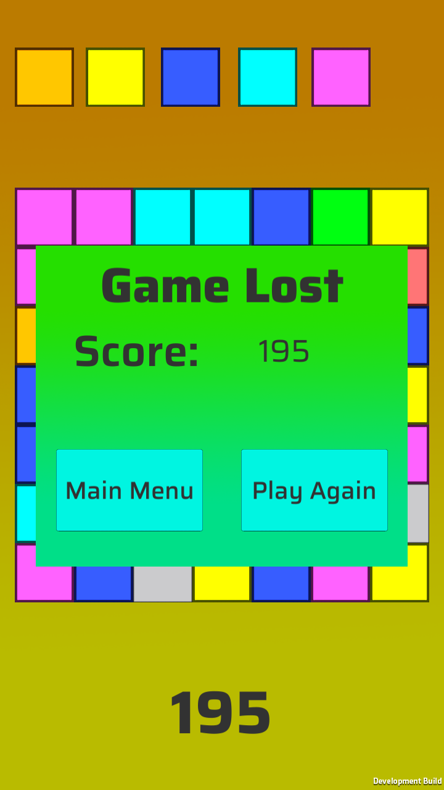

# Lines
Simple arcade game <i>Lines</i> for Android created with Unity3D.

Used Unity3D version: 5.6.1f1

## Game
The game starts on a 7x7 arena with several blocks in one of 6 colors. The player have to set up lines (vertical or horizontal) with three or more blocks in the same color.

Game based on <i><b>Game Lines</b></i> created in 1992 by <i>Gamos</i>. [Wikipedia](https://en.wikipedia.org/wiki/Color_Lines)

## Screenshots

        
        
        </img>
        
        </img>
        
        </img>

